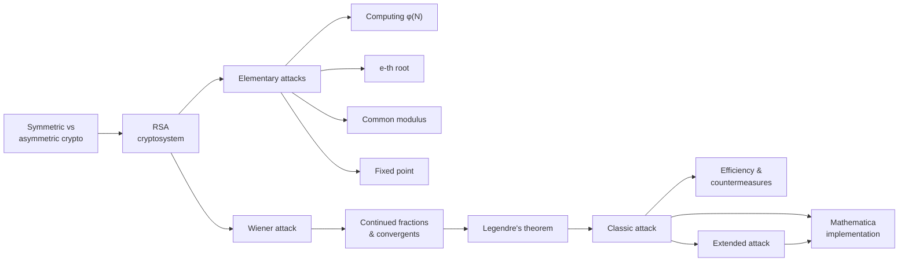
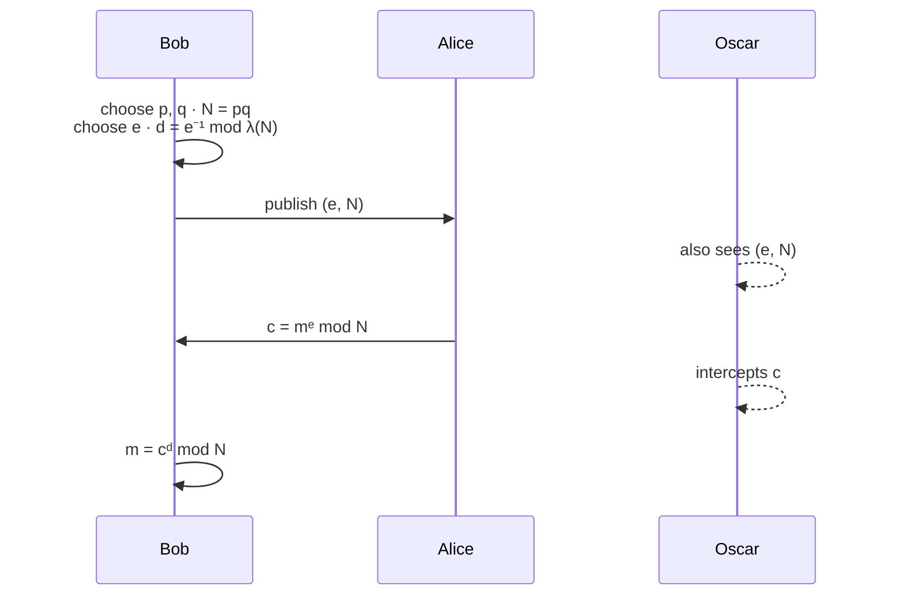
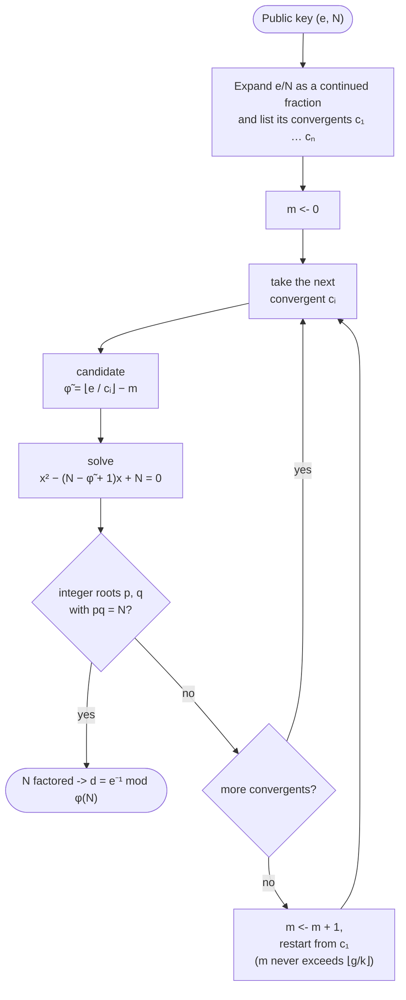

# Wiener, attack!

A short monograph (in Italian, typeset with LaTeX in the *Tufte* book style) that walks through the [RSA cryptosystem](https://en.wikipedia.org/wiki/RSA_cryptosystem), its most common elementary attacks, and the continued-fraction attack on small private exponents published by Michael J. Wiener in 1990. It ends with a compact implementation of the classic and the extended attack in *Wolfram Mathematica* — [Read the paper](src/wiener_attack.pdf).


> *Is mathematics "useful", directly useful, as other sciences such as chemistry and physiology are? This is not an altogether easy or uncontroversial question, and I shall ultimately say No…*
> — G.H. Hardy, *A Mathematician's Apology*, 1940

The paper opens with Hardy's famous claim that number theory is "useless", and then shows how that same theory became the foundation of computational number theory and asymmetric cryptography.


## Repository layout

```
.
├── README.md
├── LICENSE                     # GPL-3.0
├── assets/
│   ├── snoopy.gif
│   └── code/
│       ├── classic.wl          # classic Wiener attack (wolframscript)
│       └── extended.wl         # Verheul–van Tilborg extension (wolframscript)
└── src/
    ├── wiener_attack.pdf       # the compiled paper  <- start here
    ├── main.tex                # LaTeX source of the paper
    ├── bibliography.bib        # Tufte template leftover (not used by the paper)
    ├── tufte-book.cls          # document class
    ├── tufte-common.def
    ├── *.jpg / *.png / *.pdf   # figures (Escher, Tenniel's Alice, Peanuts, COPACOBANA, …)
    ├── graphics/ …             # Tufte template graphics
    ├── book_1_template.*       # Tufte book template
    └── template/ …             # original Tufte-book template
```

The repository is mostly the paper itself: the code lives in its Appendix, and is also provided as the standalone scripts in [`assets/code/`](https://github.com/matteogiorgi/wiener/tree/master/assets/code).


## What the paper covers



| Chapter | Section | Topics |
|---|---|---|
| **Towards RSA** | Introduction | Symmetric ciphers and their limits (key distribution, $O(n^2)$ keys, no authentication), DES and its brute-force history (Deep Crack, COPACOBANA), Diffie–Hellman's idea, one-way trapdoor functions, hybrid protocols (SSL/TLS, IPsec) |
| | The RSA cryptosystem | Euler's $\phi$, Möbius $\mu$, Euler–Fermat theorem, key generation, encryption/decryption, Chinese Remainder Theorem, Carmichael's $\lambda$, [PKCS #1](https://www.rfc-editor.org/info/rfc8017/) |
| | Elementary attacks | Computing $\phi(N)$, $e$-th root, common modulus, fixed-point (cycling) attack |
| **Wiener's attack** | The role of convergents | Regular continued fractions, recursive computation of convergents, monotonicity lemmas, best rational approximations, Legendre's theorem |
| | Classic attack | Wiener's theorem and proof, search algorithm, $O(\log_2 N)$ complexity |
| | Efficiency & countermeasures | Balanced primes, distribution of $g=\gcd(p-1,q-1)$, Wiener bound, Boneh–Durfee bound, CRT decryption |
| | Extended attack | Verheul–van Tilborg brute-force extension, Dujella's improvement |
| **Appendix** | | Mathematica implementation of both attacks |

Throughout the paper the usual cast is used: **Alice** (sender), **Bob** (receiver) and **Oscar** (the cryptanalyst).


## 1. RSA in a nutshell

Bob picks two large primes $p, q$ and computes the modulus $N = pq$. He then chooses a public exponent $e \in \mathbb{Z}^\ast_{\phi(N)}$ and computes the private exponent $d$ such that $ed \equiv 1 \pmod{\phi(N)}$:

$$
k_{pub} = (e, N) \qquad k_{priv} = (d, p, q)
$$

$$
\mathrm{Enc}_k : m \mapsto c = m^e \bmod N \qquad\qquad \mathrm{Dec}_k : c \mapsto m = c^d \bmod N
$$

Correctness follows from the **Euler–Fermat theorem** ($a^{\phi(n)} \equiv 1 \pmod n$ for $\gcd(a,n)=1$), extended to messages not coprime with $N$ via the Chinese Remainder Theorem. Writing $ed = 1 + k\phi(N)$ for some integer $k$:

$$
c^d \equiv (m^e)^d = m^{1+k\phi(N)} \equiv m \pmod N
$$

While inverting $e$ modulo $\phi(N)$ is *sufficient*, the *necessary* condition is that $e, d$ are inverse modulo **Carmichael's function** $\lambda(N) = \mathrm{lcm}(p-1, q-1)$, which is what [PKCS #1](https://www.rfc-editor.org/info/rfc8017/) prescribes. The two are related by

$$
\phi(N) = (p-1)(q-1) = \gcd(p-1,q-1)\thinspace\lambda(N)
$$




## 2. Elementary attacks

The paper focuses on *indirect algorithmic* attacks, which exploit mathematical weaknesses or misuse of the system rather than attacking factorization head-on.

| Attack | Idea | Result |
|---|---|---|
| **Computing $\boldsymbol{\phi(N)}$** | Since $p+q = N - \phi(N) + 1$, $p$ and $q$ are the roots of $x^2 - (N-\phi(N)+1)\thinspace x + N = 0$ | $\phi(N) \overset{\mathcal P}{\Longleftrightarrow} \text{factoring } N$ |
| **$\boldsymbol{e}$-th root** | Knowing $\phi(N)$, solve $ed - k\phi(N) = 1$ with the extended Euclidean algorithm to get $d$, then $m = c^d \bmod N$ | $\phi(N) \overset{\mathcal P}{\Longrightarrow} \sqrt[e]{c} \bmod N$ |
| **Common modulus** | Same $m$ encrypted under the same $N$ with coprime $e_1 \ne e_2$: find $e_1x + e_2y = 1$ | $c_1^x c_2^y \equiv m^{e_1x+e_2y} \equiv m \pmod N$ |
| **Fixed point** | $\mathrm{Enc}_k$ is a permutation: re-encrypting $c$ eventually cycles back to $c$ | if $c^{(e^k)} \equiv c$ then $c^{(e^{k-1})} \equiv m$ |

The first row is the key fact reused by Wiener's attack $\Rightarrow$ anyone who learns $\phi(N)$ can factor $N$:

$$
(p, q) = \frac{A \pm \sqrt{A^2 - 4N}}{2}, \qquad A = N - \phi(N) + 1
$$

Two open problems are stated along the way: whether computing $e$-th roots modulo $N$ is actually as hard as factoring, and whether $d < \sqrt N$ can always be recovered in polynomial time.


## 3. Wiener's attack

Small private exponents are tempting because they make decryption fast (e.g. on smart cards). Wiener showed that if $d$ is roughly smaller than $\sqrt[4]{N}$, then $d$ can be recovered from the public key alone:

$$
(e, N) \xrightarrow[d\ \text{small}]{\mathcal P} \lbrace d\rbrace
$$


### 3.1 Continued fractions and convergents

A regular continued fraction is written $\gamma = [\beta_0;\beta_1,\dots,\beta_n]$, and its $i$-th convergent is $c_i = [\beta_0;\beta_1,\dots,\beta_i] = a_i/b_i$, where

$$
a_i = \beta_i a_{i-1} + a_{i-2}, \qquad b_i = \beta_i b_{i-1} + b_{i-2}, \qquad (a_{-1},b_{-1}) = (1,0),\ (a_0,b_0) = (\beta_0,1)
$$

The paper proves that:

- every convergent is already in lowest terms, since $a_{i-1}b_i - a_ib_{i-1} = (-1)^i$;
- even convergents increase strictly, odd ones decrease strictly, and $\gamma$ lies between them;
- each convergent $a_n/b_n$ approximates $\gamma$ better than any other fraction whose denominator is at most $b_n$;
- **Legendre's theorem**: if a fraction is "close enough" to $\gamma$, it *must* be one of its convergents:

$$
\left|\gamma - \frac{a}{b}\right| < \frac{1}{2b^2} \quad\Longrightarrow\quad \frac{a}{b} \in \lbrace c_i\rbrace
$$

The expansion of a rational $x/y$ is computed with exactly the same quotients as the Euclidean algorithm for $\gcd(x,y)$, so it has $O(\log y)$ terms; for $e/N$ that is $O(\log N)$.


### 3.2 The classic attack

**Theorem (Wiener).** Let $N = pq$ and $e,d \in \mathbb{Z}^\ast_{\lambda(N)}$. Write $g = \gcd(p-1,q-1)$ and $k = (ed-1)/\lambda(N)$, and set $k = k_0\gcd(k,g)$, $g = g_0\gcd(k,g)$. If

$$
d < \frac{pq}{2(p+q-1)\thinspace k_0 g_0} = \frac{N}{2\thinspace(N-\phi(N))\thinspace k_0 g_0}
$$

then $N$ can be factored in time polynomial in $\log_2 N$.

*Proof sketch.* From $\phi(N) = g\lambda(N)$ and $ed = 1 + k\lambda(N)$ we get $ed = 1 + \frac{k}{g}\phi(N)$. Dividing by $dN$ and using the hypothesis gives

$$
\left|\frac{e}{N} - \frac{k_0}{d g_0}\right| < \frac{1}{2\thinspace(d g_0)^2}
$$

which is exactly the hypothesis of Legendre's theorem. Therefore $k_0/(dg_0)$ is one of the convergents of $e/N$, and once you have the right convergent $c$:

$$
\phi(N) = \left\lfloor \frac{e}{c} \right\rfloor - \left\lfloor \frac{g_0}{k_0} \right\rfloor
$$



There are $O(\log_2 N)$ convergents and $m$ is bounded by $\lfloor g/k \rfloor$, so, as long as $\lfloor g/k \rfloor$ is a small constant (the typical case, see below), the overall search costs $\Theta(\log_2 N)$ candidate checks.


### 3.3 Efficiency

- The right convergent has denominator $dg_0$, so any convergent $c_i = a_i/b_i$ with $\lvert e/N - c_i\rvert \ge 1/(2b_i^2)$ can be discarded a priori.
- With **balanced primes** ($p < q < 2p$) we have $\lvert N - \phi(N)\rvert = \lvert p+q-1\rvert < 3\sqrt N$, so $N$ and $\phi(N)$ share about half of their most significant bits.
- For random balanced primes, $g = \gcd(p-1,q-1)$ is usually tiny. Experiments on 128–1024-bit primes in the paper give $\Pr[g \le 6] \approx 0.77$ and $\Pr[g \le 20] \approx 0.91$. In practice $\lfloor g/k \rfloor = 0$, and **a single pass** ($m=0$) over the convergents is enough.

**Worked example (from the paper).** With $(e, N) = (58549809,\ 2447482909)$:

$$
\frac{e}{N} = [0;\thinspace41,\thinspace1,\thinspace4,\thinspace23,\dots], \qquad \lbrace c_i\rbrace  = \left\lbrace 0,\ \tfrac{1}{41},\ \tfrac{1}{42},\ \tfrac{5}{209},\ \tfrac{116}{4849},\ \dots\right\rbrace
$$

The convergent $c_3 = 5/209$ gives $\tilde\phi = \lfloor e/c_3 \rfloor = 2447382016$, which factors $N = 60317 \cdot 40577$. So $d = 209$, comfortably below the theorem's bound ($\approx 2426$).


### 3.4 Countermeasures

Under the usual assumptions ($e$ about as long as $N$, balanced primes, small $g_0$) the theorem reduces to the familiar **Wiener bound**:

$$
d < \frac{1}{\omega}\sqrt[4]{N}, \qquad \omega > 1
$$

So with a 2048-bit modulus, $d$ must be at least ~512 bits long. The paper lists some ways to keep $d$ small while weakening the attack:

1. use **unbalanced primes** to make $N - \phi(N)$ larger;
2. pick $p, q$ with a **large $g$** (as in *Common Prime RSA*);
3. use a **large public exponent** $e > N$, obtained by adding a multiple of $\lambda(N)$ to $e$; for $e > N^{3/2}$ the attack is no longer guaranteed to succeed;
4. decrypt with the **CRT**, using small $d_p \equiv d \pmod{p-1}$ and $d_q \equiv d \pmod{q-1}$ while $d$ itself stays of order $\phi(N)$.

Setting $d = N^\delta$ and $e = N^\sigma$ (with balanced primes and small $g_0$), the attack works roughly when

$$
\delta < \frac{3}{4} - \frac{\sigma}{2} - \nu
$$

where $\nu > 0$ absorbs the lower-order terms of the approximation. So small public exponents strengthen the attack (up to $\delta = 1/2$ when $\sigma = 1/2$) and large ones kill it ($\sigma = 3/2$). The paper also notes that the Wiener bound is not tight: Boneh and Durfee (1998) pushed it to $d < N^{0.292}$, and the correct bound is conjectured to be $\sqrt N$.


### 3.5 The extended attack

If $d = N^{0.25+\tau}$ the classic attack almost surely fails. Verheul and van Tilborg (1997) showed that the missing information can be brute-forced. With $r = \log_2 d - \log_2\sqrt[4]{N}$, the right fraction can be written in terms of two *consecutive* convergents $c_t = a_t/b_t$ and $c_{t+1} = a_{t+1}/b_{t+1}$:

$$
\frac{k_0}{d g_0} = \frac{U a_{t+1} + (U\Delta + V)\thinspace a_t}{U b_{t+1} + (U\Delta + V)\thinspace b_t}, \qquad \log_2 U,\ \log_2 V \le r + 4
$$

where $\Delta$ is a small integer constant. For each of the $n-1$ pairs of consecutive convergents ($n$ being the number of convergents of $e/N$), the attacker tries the $2^{2r+8}$ possible values of $(U,V)$ and tests the resulting candidate $\tilde\phi = \lfloor e\thinspace dg_0/k_0 \rfloor - m$ exactly as before.

With a 64-bit brute-force budget, $2r+8 = 64$ gives $r = 28$: any RSA instance with $d < 2^{28}\sqrt[4]{N}$ falls. Dujella (2004) later narrowed the search for the right convergents to only three pairs.


## 4. Implementation (Mathematica)

The Appendix of the paper implements both attacks in a handful of lines of Wolfram Language. The same code is in [`assets/code/`](https://github.com/matteogiorgi/wiener/tree/master/assets/code).


### Classic attack: [`classic.wl`](https://github.com/matteogiorgi/wiener/blob/master/assets/code/classic.wl)

```mathematica
e = 7502876735617; n = 28562942440499; (* example of an attackable public key *)
fc = ContinuedFraction[e/n];
cList = Convergents[fc];
phiList = Floor[e/Rest[cList]];                      (* candidate φ(N) for every convergent *)

(* a candidate φ is right iff both roots of x² − (n − φ + 1)x + n divide n *)
check[phi_] := (x/.p) /; (Mod[n,x] /. (p=Solve[x^2-(n-phi+1)x+n==0,x])) == {0, 0};
checkL[phi_List] := Flatten[Cases[check /@ phi,_List]];

primes = Flatten[checkL /@ (phiList-m /. {m->#}& /@ Range[0,9])];   (* try m = 0 … 9 *)
```

| Step | Wolfram code | Section |
|---|---|---|
| expand $e/N$ | `ContinuedFraction`, `Convergents` | [§3.1](#31-continued-fractions-and-convergents) |
| $\tilde\phi = \lfloor e/c_i \rfloor - m$ | `Floor[e/Rest[cList]]`, `phiList - m` | [§3.2](#32-the-classic-attack) |
| factor via $\phi(N)$ | `Solve[x^2-(n-phi+1)x+n==0, x]` | [§2](#2-elementary-attacks), $\phi(N) \Leftrightarrow$ factoring |

For the sample key above the expansion is $e/N = [0;3,1,4,5,1,1,3,\dots]$, and the convergent $202/769$ reveals

```text
d = 769      p = 5685857      q = 5023507
```


### Extended attack: [`extended.wl`](https://github.com/matteogiorgi/wiener/blob/master/assets/code/extended.wl)

```mathematica
r = 4; Dl = 2; (* tune to the case at hand *)
CClist = Partition[Rest[cList],2,1];                 (* pairs of consecutive convergents *)
UVlist = Tuples[Range[2^r],2];                       (* all (U, V) to try *)
T = Tuples[{CClist,UVlist}];
phiList = Floor[
  e(T[[2,1]]Denominator[T[[1,2]]]+(T[[2,1]]Dl+T[[2,2]])Denominator[T[[1,1]]])/
   (T[[2,1]] Numerator[T[[1,2]]]+(T[[2,1]]Dl+T[[2,2]])Numerator[T[[1,1]]])];

primes = Flatten[checkL /@ (phiList-m /. {m->#}& /@ Range[0,9])];
```

`extended.wl` reuses `e`, `cList` and `checkL` from the classic script, so it has to run in the same session after it. `r` (search size) and `Dl` ($\Delta$) are parameters to tune.


### Running

With [`wolframscript`](https://www.wolfram.com/wolframscript/) installed, from the repository root:

```bash
# classic attack
wolframscript -code 'Get["assets/code/classic.wl"]; primes'

# extended attack (needs the definitions from classic.wl)
wolframscript -code 'Get["assets/code/classic.wl"]; Get["assets/code/extended.wl"]; primes'
```

Both scripts end with a `;`, which suppresses output, so `primes` is evaluated explicitly at the end. You can also paste the cells into a Mathematica notebook and evaluate `primes`.


## Building the paper

The paper is written in Italian with the [`tufte-book`](https://ctan.org/pkg/tufte-latex) class (included in `src/`). It uses wide margins for definitions, lemmas, side notes and historical asides. With a full TeX distribution (e.g. TeX Live):

```bash
cd src
latexmk -pdf main.tex
```

The precompiled output is [`src/wiener_attack.pdf`](https://github.com/matteogiorgi/wiener/blob/master/src/wiener_attack.pdf).


## Main references

1. W. Diffie, M. Hellman — *New Directions in Cryptography*, IEEE Trans. Inf. Theory, 1976.
2. R.L. Rivest, A. Shamir, L. Adleman — *A Method for Obtaining Digital Signatures and Public-Key Cryptosystems*, Commun. ACM, 1978.
3. G.J. Simmons, M.J. Norris — *Preliminary comments on the MIT public-key cryptosystem*, Cryptologia, 1977.
4. **M.J. Wiener — *Cryptanalysis of Short RSA Secret Exponents*, IEEE Trans. Inf. Theory, 1990.**
5. D. Boneh — *Twenty years of attacks on the RSA cryptosystem*, Notices of the AMS, 1999.
6. E.R. Verheul, H.C.A. van Tilborg — *Cryptanalysis of 'less short' RSA secret exponents*, AAECC, 1997.
7. A. Dujella — *Continued fractions and RSA with small secret exponent*, Tatra Mt. Math. Publ., 2004.
8. D. Boneh, G. Durfee — *Cryptanalysis of RSA with Private Key d Less Than N^0.292*, 1998.
9. *PKCS #1: RSA Cryptography Specifications Version 2.2*, IETF, 2012.

The full bibliography is at the end of the paper, written directly in [`src/main.tex`](https://github.com/matteogiorgi/wiener/blob/master/src/main.tex) (`thebibliography` environment).
